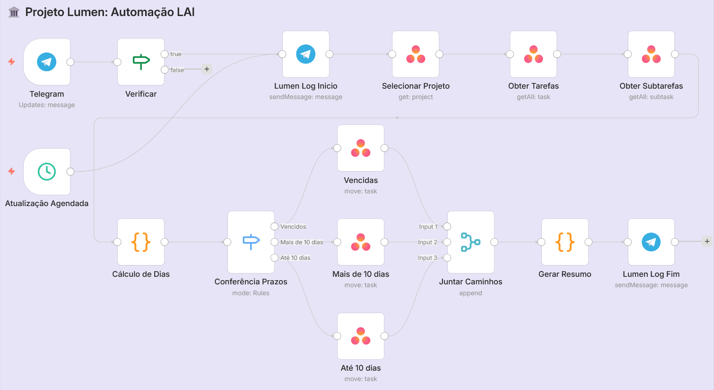

# 📖 Documentação Técnica - Projeto Lumen Pessoal

Este documento detalha o funcionamento lógico e técnico do workflow de automação desenvolvido no n8n para a gestão de prazos da Lei de Acesso à Informação (LAI) no Asana.

## ⚙️ Arquitetura do Fluxo

O workflow foi desenhado para atuar como um "camada de inteligência" sobre a versão gratuita do Asana, utilizando metadados de subtarefas para gerenciar estados que o plano *Personal* não suporta nativamente.

---

## 1. Gatilhos (Triggers)
O fluxo possui redundância de inicialização:
* **Cron Job**: Execução automática às 07:15, 12:15 e 19:15.
* **Webhook Telegram**: Gatilho manual via comando `/lumen`.

## 2. Lógica de Processamento (O "Coração" do Projeto)

### A extração de dados (Nós Asana)
O fluxo busca tarefas e, em seguida, as **subtarefas**. A automação varre o conteúdo do campo `notes` (descrição) de subtarefas específicas:
* **Subtarefa "Abertura"**: Busca a string de data/hora.
* **Subtarefa "Encerramento"**: Busca a data limite.

### O Nó de Código (JavaScript)
O nó **"Cálculo de Dias"** utiliza JavaScript para:
1. Validar o fuso horário (Brasília -03:00).
2. Priorizar a data de **Encerramento** (se hoje > vencimento = **Vencido**).
3. Calcular o "aniversário" do cartão (se dias desde abertura >= 10 = **Mais de 10 dias**).

## 3. Classificação e Movimentação
Após o cálculo, o nó **Switch** (Conferência de Prazos) distribui os objetos para os nós de destino:

| Classificação | Seção de Destino no Asana | Prioridade |
| :--- | :--- | :--- |
| **Vencidos** | Seção de Vencidos | Crítica |
| **> 10 Dias** | Seção de Alerta / Mais de 10 dias | Alta |
| **< 10 Dias** | Seção Inicial / Até 10 dias | Normal |

## 4. Notificações e Monitoramento
O bot do Telegram atua como um console de log:
* **Início**: Confirma que o bot "acordou" e iniciou a varredura.
* **Resumo**: Consolida os dados e entrega um relatório formatado em HTML com o status atual do projeto.

---
*Documentação gerada para o repositório `projeto-lumen-pessoal`.*